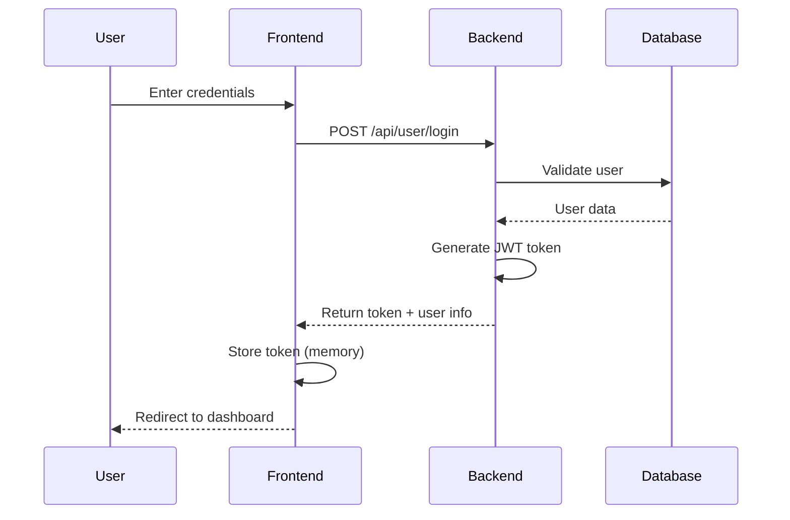

<div align="center">

# StartupNest

### Where Innovation Meets Investment


**A cutting-edge full-stack platform connecting visionary entrepreneurs with experienced mentors for startup funding and incubation**

[](https://startupnest.vercel.app)
[](./LICENSE)
[](./CONTRIBUTING.md)

</div>

---

## Table of Contents

- [Overview](#overview)
- [Key Features](#key-features)
- [Quick Start](#quick-start)
- [Tech Stack](#tech-stack)
- [Project Architecture](#project-architecture)
- [Authentication & Security](#authentication--security)
- [Deployment](#deployment)
- [Contributing](#contributing)
- [License](#license)

---

## Overview

**StartupNest** revolutionizes the startup incubation ecosystem by creating a seamless bridge between ambitious entrepreneurs and experienced mentors. Our platform streamlines the entire funding journey—from discovery to decision.

### Why StartupNest?

| Challenge | Solution |
|-----------|----------|
| Finding the Right Mentor | Smart filtering by industry, stage, and funding criteria |
| Tracking Progress | Real-time status updates and notifications |
| Professional Presentation | Integrated pitch deck uploads and detailed profiles |
| Security Concerns | JWT-based authentication with role-based access control |
| Accessibility | Responsive design that works flawlessly on all devices |

---

## Key Features

### For Entrepreneurs

- **Discover Opportunities**: Browse curated mentor profiles with detailed funding criteria
- **Submit Ideas**: Upload pitch decks and comprehensive startup details
- **Real-time Tracking**: Monitor submission status (Submitted → Shortlisted → Rejected)
- **Instant Notifications**: Get notified when mentors review your submission
- **Portfolio Management**: Manage multiple submissions from one dashboard
- **Analytics**: View submission success rates and feedback

### For Mentors

- **Create Profiles**: Define funding criteria, equity expectations, and preferences
- **Review Submissions**: Evaluate entrepreneur proposals with detailed information
- **Quick Actions**: Shortlist or reject ideas with one click
- **Track Statistics**: Monitor submission trends and portfolio performance
- **Smart Filtering**: Filter submissions by status, industry, and criteria
- **Profile Management**: Edit or delete funding opportunities anytime

### Design Excellence

| Feature | Description |
|---------|-------------|
| **Modern UI** | Purple/violet gradient theme with glassmorphism effects |
| **Animations** | Smooth micro-interactions and aurora background effects |
| **Responsive** | Mobile-first design that adapts to any screen size |
| **Accessible** | WCAG compliant with keyboard navigation support |

---

## Quick Start

### Prerequisites

Before you begin, ensure you have the following installed:

```bash
node --version    # v14.0.0 or higher
npm --version     # v6.0.0 or higher
mongod --version  # v4.4.0 or higher
```

### Installation

**Step 1: Clone & Install**

```bash
# Clone the repository
git clone https://github.com/Venu22003/startupnest.git
cd startupnest

# Install dependencies (frontend)
npm install --legacy-peer-deps

# Install dependencies (backend)
cd backend
npm install
cd ..
```

**Step 2: Environment Configuration**

Create `.env.local` in the root directory:

```env
NEXT_PUBLIC_API_URL=http://localhost:8080/api
NEXT_PUBLIC_APP_NAME=StartupNest
```

Create `.env` in the `backend/` directory:

```env
PORT=8080
NODE_ENV=development
MONGODB_URI=mongodb://127.0.0.1:27017/startupnest
JWT_SECRET=your_super_secure_jwt_secret_change_this_in_production
```

> **Security Note**: Always use strong, unique secrets in production!

**Step 3: Launch Application**

Open **three terminal windows**:

**Terminal 1 - MongoDB:**
```bash
mongod
```

**Terminal 2 - Backend Server:**
```bash
cd backend
npm start
# Server running on http://localhost:8080
```

**Terminal 3 - Frontend:**
```bash
npm run dev
# Application running on http://localhost:3000
```

Navigate to **http://localhost:3000/startupnest** to see your application in action!

---

## Tech Stack

### Frontend

| Technology | Purpose | Version |
|------------|---------|---------|
| Next.js | React Framework | 14.2 |
| TypeScript | Type Safety | 5.0 |
| Tailwind CSS | Styling | 3.4 |
| Shadcn UI | Components | Latest |
| React Hook Form | Form Handling | 7.x |

### Backend

| Technology | Purpose | Version |
|------------|---------|---------|
| Node.js | Runtime | 14+ |
| Express | Web Framework | 4.x |
| MongoDB | Database | 4.4+ |
| Mongoose | ODM | 8.x |
| JWT | Authentication | Latest |

---

## Project Architecture

```
startupnest/
│
├── app/                          # Next.js App Router
│   ├── api/                      # API routes
│   ├── startupnest/              # Main application
│   │   ├── entrepreneur/         # Entrepreneur modules
│   │   │   ├── home/            # Dashboard
│   │   │   ├── opportunities/   # Browse mentors
│   │   │   └── my-submissions/  # Track submissions
│   │   ├── mentor/               # Mentor modules
│   │   │   ├── home/            # Dashboard
│   │   │   ├── add-profile/     # Create opportunity
│   │   │   ├── view-profiles/   # Manage profiles
│   │   │   └── submissions/     # Review submissions
│   │   ├── login/                # Authentication
│   │   ├── signup/               # Registration
│   │   └── page.tsx              # Landing page
│   ├── globals.css               # Global styles
│   └── layout.tsx                # Root layout
│
├── backend/                      # Express.js backend
│   ├── controllers/              # Business logic
│   │   ├── userController.js
│   │   ├── startupProfileController.js
│   │   └── startupSubmissionController.js
│   ├── models/                   # MongoDB schemas
│   │   ├── User.js
│   │   ├── StartupProfile.js
│   │   └── StartupSubmission.js
│   ├── routes/                   # API endpoints
│   ├── utils/                    # Helper functions
│   ├── index.js                  # Server entry point
│   └── .env                      # Environment variables
│
├── components/                   # Reusable components
│   ├── ui/                       # Shadcn UI components
│   ├── Aurora.tsx                # Background animation
│   └── ...
│
├── lib/                          # Utilities & helpers
│   ├── api-client.ts            # API wrapper
│   ├── config.ts                # Configuration
│   ├── validation.ts            # Form validators
│   └── hooks/                   # Custom React hooks
│
└── Configuration files
    ├── .env.local               # Frontend env
    ├── package.json             # Dependencies
    ├── tsconfig.json            # TypeScript config
    └── tailwind.config.ts       # Tailwind config
```

---

## Authentication & Security

### Authentication Flow



### Security Features

| Feature | Implementation | Status |
|---------|----------------|--------|
| **Password Hashing** | bcrypt with salt rounds | ✅ Active |
| **JWT Tokens** | 1-hour expiration | ✅ Active |
| **Input Validation** | Server-side + Client-side | ✅ Active |
| **CORS Protection** | Configurable origins | ✅ Active |
| **SQL Injection** | Mongoose parameterized queries | ✅ Active |
| **XSS Protection** | Input sanitization | ✅ Active |

### Password Requirements

- Minimum 8 characters
- At least one uppercase letter
- At least one lowercase letter
- At least one number
- Special characters recommended

---

## Deployment

### Frontend (Vercel)

```bash
# Install Vercel CLI
npm i -g vercel

# Deploy
vercel --prod
```

**Environment Variables:**
```env
NEXT_PUBLIC_API_URL=https://api.yourdomain.com
NEXT_PUBLIC_APP_NAME=StartupNest
```

[](https://vercel.com/new)

### Backend (Railway/Render)

**Environment Variables:**
```env
PORT=8080
NODE_ENV=production
MONGODB_URI=mongodb+srv://...
JWT_SECRET=production_secret
ALLOWED_ORIGINS=https://yourdomain.com
```

[](https://railway.app)

### Database (MongoDB Atlas)

1. Create account at [MongoDB Atlas](https://www.mongodb.com/cloud/atlas)
2. Create cluster (Free tier available)
3. Get connection string
4. Whitelist IP addresses
5. Update `MONGODB_URI` in environment variables

---

## Troubleshooting

### Common Issues & Solutions

**MongoDB connection failed**

```bash
# Check if MongoDB is running
mongod --version

# Start MongoDB
# macOS/Linux:
brew services start mongodb-community

# Windows:
net start MongoDB
```

**Port already in use**

```bash
# Find and kill process (macOS/Linux)
lsof -ti:3000 | xargs kill -9
lsof -ti:8080 | xargs kill -9

# Windows PowerShell
Get-Process -Id (Get-NetTCPConnection -LocalPort 3000).OwningProcess | Stop-Process
```

**Module not found**

```bash
# Clear cache and reinstall
rm -rf node_modules package-lock.json
npm install --legacy-peer-deps
```

**CORS errors**

- Check `ALLOWED_ORIGINS` in backend `.env`
- Ensure frontend URL is whitelisted
- Verify `NEXT_PUBLIC_API_URL` matches backend

---

## Contributing

We welcome contributions! Here's how you can help:

### How to Contribute

1. **Fork the Repository** - Click the "Fork" button on GitHub
2. **Clone Your Fork** - `git clone https://github.com/your-username/startupnest.git`
3. **Create Feature Branch** - `git checkout -b feature/amazing-feature`
4. **Make Changes** - Code your feature and commit
5. **Push to Fork** - `git push origin feature/amazing-feature`
6. **Open Pull Request** - Submit your changes for review

### Contribution Ideas

| Category | Ideas |
|----------|-------|
| **Bug Fixes** | Fix reported issues, improve error handling |
| **Features** | Email notifications, advanced search, analytics |
| **Documentation** | Improve guides, add examples, fix typos |
| **Design** | UI improvements, animations, accessibility |
| **Performance** | Optimize queries, reduce bundle size |
| **Testing** | Add tests, improve coverage |

### Code Style

- Use TypeScript for type safety
- Follow existing code structure
- Write meaningful commit messages
- Add comments for complex logic
- Update documentation
- Test your changes thoroughly

---

## License

This project is licensed under the **MIT License** - see the [LICENSE](LICENSE) file for details.

[](https://opensource.org/licenses/MIT)

---

## Support & Contact

### Need Help?

- **Discussions**: [Join the conversation](https://github.com/Venu22003/startupnest/discussions)
- **Bug Reports**: [Report a bug](https://github.com/Venu22003/startupnest/issues/new)
- **Feature Requests**: [Request a feature](https://github.com/Venu22003/startupnest/issues/new)

---

## Acknowledgments

Special thanks to these amazing projects:

[](https://nextjs.org/)
[](https://tailwindcss.com/)
[](https://ui.shadcn.com/)
[](https://www.mongodb.com/)
[](https://vercel.com/)

---

<div align="center">

## Show Your Support

**If you found this project helpful, please consider giving it a ⭐ star!**

[](https://github.com/Venu22003/startupnest)

---

### StartupNest — *Where Innovation Meets Investment*

[](./LICENSE)
[](https://nextjs.org/)
[](https://www.typescriptlang.org/)
[](https://www.mongodb.com/)

[⬆ Back to Top](#startupnest)

---

<sub>© 2025 StartupNest. All rights reserved.</sub>

</div>
